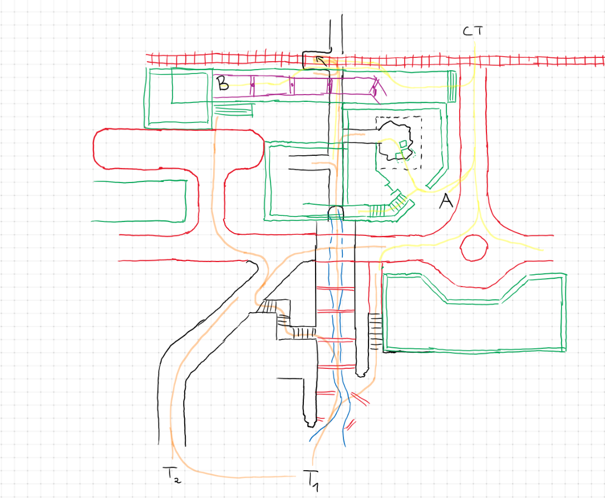
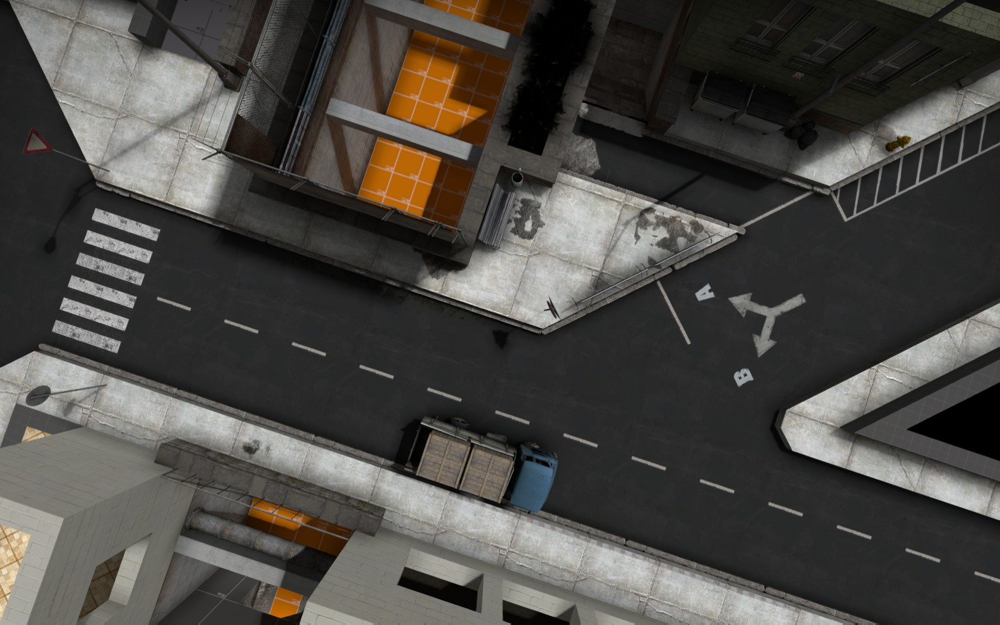

# de_creek

Chronological overview on the development steps of **de_creek**

## Planning the Map

## layout with dev textures

## starting to detail

* starting with the street in the middle of the map

The street serves as a connecting element between lower, the bombsites and spawns. It is designed to be very open - a good opportunity for snipers

* continuing with the creek (lower)

The lower part contains the creek, which changes to an underground canal below the main apartment building. The canal offers secondary access to both bombsites.

* adding buildings

The first building stands in the center of the map and is largely static. You can enter an apartment via the balconies, which might be a nice spot for saving. 

The main apartment building contains a hallway that connects the A and B site. You can enter from the station and A site. There is also a window that allows you to look out mid.

* Building the station and B Site

coming soon